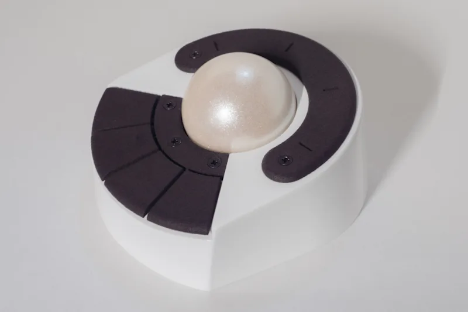

# knot-c ガイド

## knot-cについて

分割キーボードの真ん中におくことを念頭において設計されたトラックボールです。

詳しくは https://5z6p.com/products/knot-c/ をご覧ください。

## ファームウェア

[Release](https://github.com/hsgw/knot-c/releases/)にてビルド済みのファームウェアを配布しています。

書き込み方法などは https://5z6p.com/products/knot-c/ を参考にしてください。

ファームウェアのソースコードはこちらです。  
https://github.com/hsgw/vial-qmk/tree/dm9records/knot_c/keyboards/dm9records/knot_c

- knot_c-default.uf2
  - 通常のキーマップ
- knot_c-vial.uf2
  - vial対応、knot-c config tool対応

smooth scroll対応版もあります。

## 設定

vial対応のファームウェアではトラックボールの感度などを以下のwebアプリで設定できます。  
chromeのみで動作します。

https://hsgw.github.io/knot-c_config_tool/

キーマップに関しては通常のvialを利用してください。

https://vial.rocks

## 3Dプリント用ファイル

**準備中です**

基板以外の部分は3Dプリントで制作しています。  
破損した場合や色を変更したい、自分用にカスタマイズしたい場合にご利用ください。

ファイルをダウンロードした時点でライセンスに同意したものとします。

ケースに関しては基本的に互換性のあるように制作していますが、リビジョンが違うと使用できない可能性があります。同じリビジョン間での互換性だけを保証します。

### 公開履歴

- Rev.0 (非公開)
  - キーケット2026
- Rev.1
  - ボタン部のネジを2つに
  - ボールホルダーを調整

### 3Dプリント用ファイルのライセンス

以下の利用方法を**全て満たしている場合のみ**、利用を許可します。  
それ以外のファイルの利用・再配布、プリントしたもの・改変したファイルなどの商用・非商用を含む販売・配布は禁止します。

1. knot-cを所有している方が修理・予備部品・色の変更・改造のためにファイルを利用する
2. knot-cを所有している方が3Dプリントする、もしくは3Dプリント業者・工場へ依頼してプリントする
3. knot-c基板を内蔵して使用する
